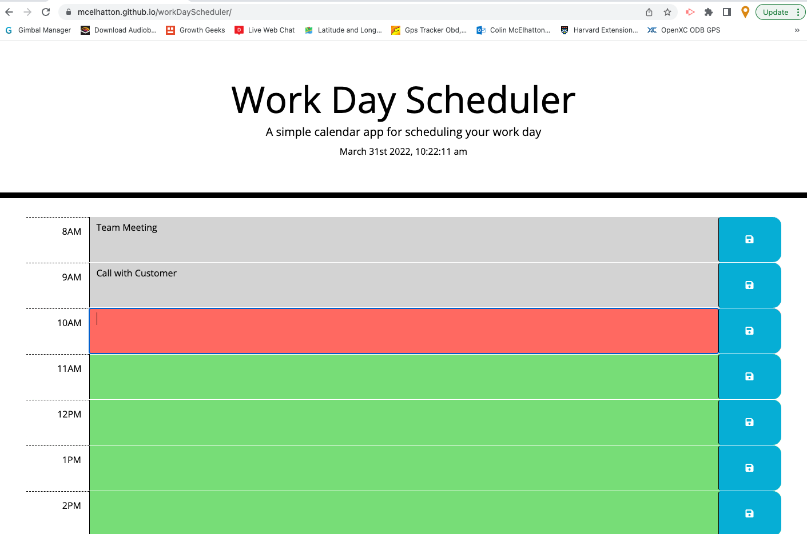

# Colin's Work Day Scheduler

## Description

This program is designed ot help get users organized!  The program will list normal business hours and users can store the schedules listed by hour.  The program will gray out hours in the past, highlight red the current hour and highlight green the hours in the future.

## Technologies Used

HTML, CSS, javascript, git, moment.js and jquery

## Usage

Load the website.  When you are ready enter text for each hour.  Click the save button.  Thats it!  All of your schedule will be saved for you to reference in the future.

## User Story

* AS AN employee with a busy schedule
I WANT to add important events to a daily planner
SO THAT I can manage my time effectively

## Acceptance Criteria

* GIVEN I am using a daily planner to create a schedule
* WHEN I open the planner
* THEN the current day is displayed at the top of the calendar
* WHEN I scroll down
* THEN I am presented with time blocks for standard business hours
* WHEN I view the time blocks for that day
* THEN each time block is color-coded to indicate whether it is in the past, present, or future
* WHEN I click into a time block
* THEN I can enter an event
* WHEN I click the save button for that time block
* THEN the text for that event is saved in local storage
* WHEN I refresh the page
* THEN the saved events persist

## Screenshot

## Credits

* W3 schools tutorials, stackoverflow, my tutor Alexis and github for help and reference.
* Built by Colin McElhatton
* Contact: colin@colinworks.com

## Link to deployed page

[Colin Code Quiz Link - Click here!]( https://mcelhatton.github.io/workDayScheduler)